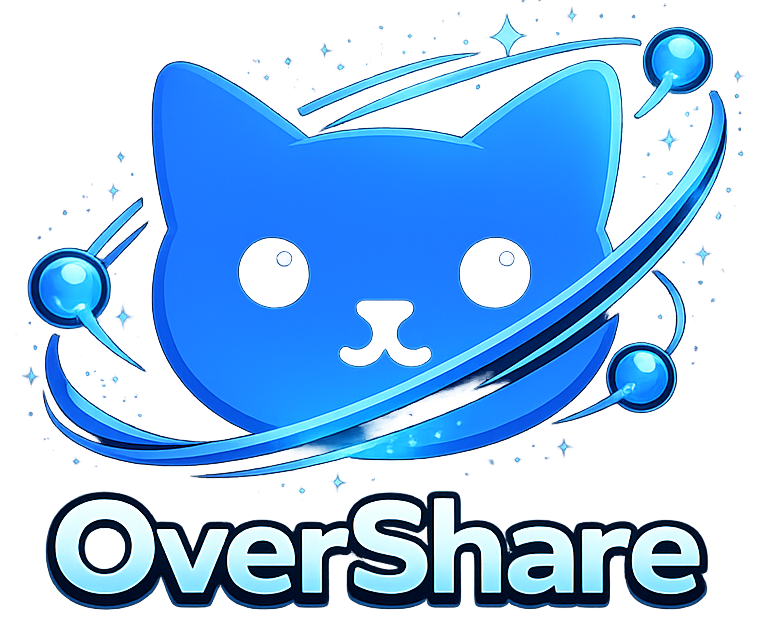

<h1 align="center">OverShare /ᐠ - ˕ -マ</h1>

<p align="center">
  
</p>

<p align="center">
  <strong>A sleek, secure file sharing server that makes transferring files across your network effortless.</strong>
</p>

<p align="center">
  <a href="#-features"><strong>Features</strong></a> •
  <a href="#-quick-start"><strong>Quick Start</strong></a> •
  <a href="#-api-endpoints"><strong>API</strong></a> •
  <a href="#-one-shot-mode"><strong>One-Shot Mode</strong></a> •
  <a href="#-configuration"><strong>Config</strong></a> •
  <a href="#-building-from-source"><strong>Build</strong></a>
</p>

---

## 📖 Overview

<p align="center">
  
</p>

**OverShare** transforms *any machine* into a **lightweight, on-demand file-sharing server** — whether you're 👥 **collaborating** on the *same network*, 🔒 distributing **sensitive materials** with *controlled one-time access*, or 📱 accessing files from **any device** without cloud services. ✨ **OverShare provides an elegant solution** with *no configuration headaches, no cloud dependencies* — just **instant, secure file sharing** through a polished web interface and a **full REST API** for automation.

---

## ✨ Features

<br>

<table>
<tr>
<td width="25%" valign="top">

### 📤 Upload & Download
- Drag-and-drop uploads  
- ZIP downloads  
- Real-time progress  
- Live updates  

</td>
<td width="25%" valign="top">

### 🎯 One-Shot Mode
- Self-destruct links  
- Download limits  
- Countdown UI  
- Auto shutdown  

</td>
<td width="25%" valign="top">

### 🛡️ Security
- Basic Auth  
- No file storage  
- JSON logs  
- Timeouts  

</td>
<td width="25%" valign="top">

### 🌟 UX
- Dark/light mode  
- QR codes  
- Keyboard shortcuts  
- Mobile ready  

</td>
</tr>
<tr>
<td width="25%" valign="top">

### 🔌 REST API
- Upload via curl  
- Download via wget  
- List files as JSON  
- ZIP multiple files  

</td>
<td width="25%" valign="top">

### 📡 Server-Sent Events
- Real-time updates  
- Live notifications  
- Event streaming  
- Webhook ready  

</td>
<td width="50%" colspan="2" valign="top">

### 🔧 Integrations
- Automate with scripts  
- Build custom clients  
- CI/CD pipelines  
- Programmatic access

</td>
</tr>
</table>

<br>

---

## 🚀 Quick Start

### Using Pre-built Binary (Recommended)

1. Download the latest release for your OS from the [Releases page](https://github.com/VexilonHacker/OverShare/releases)
2. Run the executable:

```bash
# Start server on default port 8000
./overshare

# Or specify a custom port
./overshare --port 8080
```

3. Open `http://localhost:8000` in your browser

### Using Go Install

```bash
go install github.com/VexilonHacker/OverShare@latest
overshare
```

---

## 🔌 API Endpoints

OverShare exposes a **full REST API** for programmatic access. Perfect for scripting, automation, or building custom clients.

### 📋 Get File List

```bash
curl http://localhost:8000/files
```

**Response:**
```json
["document.pdf", "image.jpg", "archive.zip"]
```

### 📤 Upload a File

```bash
curl -F "file=@/path/to/your/file.pdf" http://localhost:8000/upload
```

**Response:**
```json
{
  "status": "ok",
  "file": "file.pdf",
  "bytes": "15204321"
}
```

### 📥 Download a File

```bash
# Using curl
curl -O http://localhost:8000/download/filename.pdf

# Using wget
wget http://localhost:8000/download/filename.pdf
```

### 📦 Download Multiple Files as ZIP

```bash
# Download multiple files as a single ZIP archive
curl -O "http://localhost:8000/zip?files=file1.pdf,file2.jpg,file3.txt"
```

### ℹ️ Get Max Upload Size

```bash
curl http://localhost:8000/maxsize
```

**Response:**
```json
{"maxUploadMB":200}
```

### 🌐 Get Local IP Address

```bash
curl http://localhost:8000/api/local-ip
```

**Response:**
```json
{"ip":"192.168.1.100"}
```

### 📡 Server-Sent Events (Real-time Updates)

```bash
# Stream real-time file updates
curl -N http://localhost:8000/events
```

**Event Stream:**
```
data: {"type":"new","file":"newfile.pdf"}
data: {"type":"remove","file":"oldfile.pdf"}
```

### 🔐 With Authentication

If you've enabled Basic Auth:

```bash
# Include username and password
curl -u username:password http://localhost:8000/files

# Upload with auth
curl -u username:password -F "file=@document.pdf" http://localhost:8000/upload
```

---

## 🎯 One-Shot Mode

Share files that disappear after download. Perfect for sensitive documents or temporary transfers.

```bash
# Share a file that self-destructs after 1 download
./overshare --oneshot confidential.pdf

# Allow up to 5 downloads before shutdown
./overshare --oneshot presentation.mp4 --max-downloads 5
```

**What happens:** The server starts, displays a QR code for easy mobile access, and automatically shuts down after the file has been downloaded the specified number of times. The file is never stored in the uploads directory.

### One-Shot API

When in one-shot mode, additional endpoints are available:

```bash
# Check file status (remaining downloads)
curl "http://localhost:8000/?status=1"

# Download the file (triggers countdown)
curl -OJ "http://localhost:8000/?download=1"
```

**Status Response:**
```json
{
  "expired": false,
  "remaining": 3,
  "max": 5
}
```

---

## ⚙️ Configuration

### Server Options

| Flag | Description | Default |
|------|-------------|---------|
| `--host <ip>` | Bind to specific IP | `0.0.0.0` |
| `--port <n>` | Listening port | `8000` |
| `--maxmb <n>` | Max upload size (MB) | `200` |
| `--uploads <dir>` | Upload directory | current directory |
| `--timeout <s>` | Auto-shutdown after N seconds | disabled |

### Security Options

| Flag | Description |
|------|-------------|
| `--username <user>` | Enable Basic Auth |
| `--password <pass>` | Password for auth |
| `--log-file <path>` | JSON audit log |

### One-Shot Options

| Flag | Description | Default |
|------|-------------|---------|
| `--oneshot <file>` | File to share | required |
| `--max-downloads <n>` | Max downloads | `1` |

### Utility Options

| Flag | Description |
|------|-------------|
| `--qr` | Show QR code on startup |
| `--help` | Display help |

---

## 🔐 Authentication Example

```bash
# Start protected server
./overshare --username admin --password secure123 --port 9000
```

All routes (including static files and API) will require authentication. Failed attempts are logged.

---

## 📊 Audit Logging

Enable JSON logging for complete visibility:

```bash
./overshare --log-file /var/log/overshare.json
```

**Sample log entry:**
```json
{
  "timestamp": "2025-03-18T15:04:05Z",
  "level": "info",
  "event": "download",
  "filename": "project-backup.zip",
  "size": 15204321,
  "remote_addr": "192.168.1.15:54321",
  "duration": "1.2s"
}
```

---

## ⌨️ Keyboard Shortcuts

Press `?` in the web interface to see all shortcuts:

| Shortcut | Action |
|----------|--------|
| `?` | Show help overlay |
| `Ctrl/Cmd + F` | Focus search |
| `T` | Toggle theme |
| `Ctrl/Cmd + A` | Select all files* |
| `Ctrl/Cmd + D` | Download selected as ZIP* |

> \* *Only in selection mode*

---

## 🏗️ Building from Source

```bash
# Clone repository
git clone https://github.com/VexilonHacker/OverShare.git
cd OverShare

# Build
go mod download
go build -o overshare main.go

# Run
./overshare
```

**Note:** The `www` directory must be in the same location as the binary, or specify with `--www /path/to/www`.

---

## 📁 Project Structure

```
OverShare/
├── 📂 assts/          # Documentation assets
├── 📂 www/            # Web interface (HTML, CSS, JS)
├── 📄 main.go         # Server implementation
├── 📄 go.mod          # Go module definition
├── 📄 go.sum          # Dependency integrity checksums
└── 📄 README.md       # This file
```

---


## 📄 License

MIT © [VexilonHacker](https://github.com/VexilonHacker). See [LICENSE](LICENSE) for details.

---

<p align="center">
  /ᐠ - ˕ -マ Crafted by VexilonHacker
</p>

