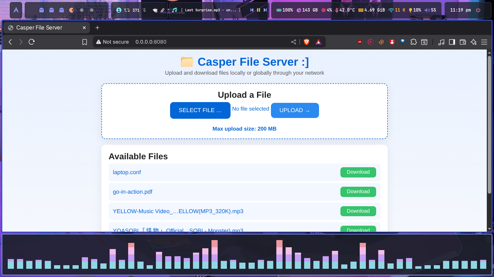

# 📁 Overshare 
#### A simple yet powerful GoLang-based local and global file sharing server




<p align="center">
  <b>Overshare</b> is a lightweight, high-performance <b>GoLang file sharing server</b> that allows you to <b>upload</b> and <b>download</b> files both <b>locally</b> and <b>globally</b> with a simple and responsive web interface ;]
</p>

---
## ✨ Features

- ⚡ **Real-time Updates** — Instant sync via **Server-Sent Events (SSE)**.  
- 💻 **Modern Frontend** — Responsive **HTML/CSS/JS** in `www/`.  
- ⚙️ **Customizable** — Change **host**, **port**, **upload directory**, and **max upload size**.  
- 🎨 **Colorful Logs** — Enhanced terminal output for readability.  
- 📁 **Safe File Handling** — Prevents overwriting and handles conflicts.  

- 📤 **Upload:** Drag-and-drop or select files via web UI.  
- 📥 **Download:** Instant downloads from interface or URL.  
- 🔁 **Auto Sync:** New files appear in real time.  

- 🧩 **API Endpoints:**  
  - `POST /upload` → Upload file  
  - `GET /files` → List files  
  - `GET /download/{filename}` → Download file  
  - `GET /events` → Real-time updates  
  - `GET /maxsize` → Get max upload size

---

## Project Structure

```bash
.
├── assts
│   └── menu.png                
├── main.go                     # Main Go server code
├── server                      # Compiled binary (generated after build)
├── uploads                     # Directory where uploaded files are stored
└── www                         # Web frontend files
    ├── index.html
    ├── index.js
    └── style.css
```

---

## 🛠️ Build & Run

### 1️⃣ Build the project

```
go build -o server main.go
```

### 2️⃣ Run the server

```
./server
```

Default output:

```

 .d88888b.                            .d8888b.  888
d88P" "Y88b                          d88P  Y88b 888
888     888                          Y88b.      888
888     888 888  888  .d88b.  888d888 "Y888b.   88888b.   8888b.  888d888 .d88b.
888     888 888  888 d8P  Y8b 888P"      "Y88b. 888 "88b     "88b 888P"  d8P  Y8b
888     888 Y88  88P 88888888 888          "888 888  888 .d888888 888    88888888
Y88b. .d88P  Y8bd8P  Y8b.     888    Y88b  d88P 888  888 888  888 888    Y8b.
 "Y88888P"    Y88P    "Y8888  888     "Y8888P"  888  888 "Y888888 888     "Y8888

                Simple GoLang File Server made by casper AKA VexilonHacker

[SERVER] Listening on 0.0.0.0:8080 | Max upload: 200 MB
[INFO] Open http://0.0.0.0:8080/ in your browser
```

---
## ⚙️ Help menu 
```text 

 .d88888b.                            .d8888b.  888
d88P" "Y88b                          d88P  Y88b 888
888     888                          Y88b.      888
888     888 888  888  .d88b.  888d888 "Y888b.   88888b.   8888b.  888d888 .d88b.
888     888 888  888 d8P  Y8b 888P"      "Y88b. 888 "88b     "88b 888P"  d8P  Y8b
888     888 Y88  88P 88888888 888          "888 888  888 .d888888 888    88888888
Y88b. .d88P  Y8bd8P  Y8b.     888    Y88b  d88P 888  888 888  888 888    Y8b.
 "Y88888P"    Y88P    "Y8888  888     "Y8888P"  888  888 "Y888888 888     "Y8888

                Simple GoLang File Server made by casper AKA VexilonHacker

Usage:
  ./server [options]

Options:
  --host     Host to bind (default 0.0.0.0)
  --port     Port to listen on (default 8080)
  --www      Directory to serve static files (default 'www')
  --uploads  Directory to store uploads (default 'uploads')
  --maxmb    Maximum upload size in MB (default 200)
  --help     Show this help menu
```

---


---

## 🧰 Example API Usage (cURL)

### Upload a file
```bash
curl -F "file=@example.txt" http://localhost:8080/upload
```

### List uploaded files
```bash
curl http://localhost:8080/files
```

### Download a file
```bash
curl -O http://localhost:8080/download/example.txt
```

---

## 🖥️ Web Interface

The **web UI** (in `www/`) lets you:  
- Upload files with progress display  
- View and auto-refresh the file list  
- Download files instantly  

---

## 🧱 Tech Stack

- **Backend:** Go with `net/http` and SSE  
- **Frontend:** HTML, CSS, JS  
- **Concurrency:** Goroutines and channels  
- **Dependencies:** None, just pure sweet **GoLang**

---

## 📜 License

#### MIT License 

